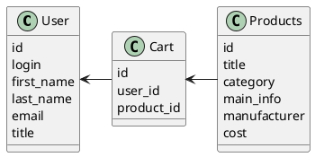

# Компонентная архитектура
<!-- Состав и взаимосвязи компонентов системы между собой и внешними системами с указанием протоколов, ключевые технологии, используемые для реализации компонентов.
Диаграмма контейнеров C4 и текстовое описание. 
-->
## Компонентная диаграмма

```plantuml
@startuml
!include https://raw.githubusercontent.com/plantuml-stdlib/C4-PlantUML/master/C4_Container.puml

AddElementTag("microService", $shape=EightSidedShape(), $bgColor="CornflowerBlue", $fontColor="white", $legendText="microservice")
AddElementTag("storage", $shape=RoundedBoxShape(), $bgColor="lightSkyBlue", $fontColor="white")

Person(user, "Пользователь")


System_Ext(web_site, "Клиентский веб-сайт", "HTML, CSS, JavaScript, React", "Веб-интерфейс")

System_Boundary(conference_site, "Сайт магазина") {
   'Container(web_site, "Клиентский веб-сайт", ")
   Container(client_service, "Сервис авторизации", "C++", "Сервис управления пользователями", $tags = "microService")    
   Container(products_service, "Сервис товаров", "C++", "Сервис управления товарами", $tags = "microService") 
   Container(cart_service, "Сервис корзины", "C++", "Сервис управления корзиной", $tags = "microService")   
   ContainerDb(db, "База данных", "MySQL", "Хранение данных о пользователях, товарах и корзин пользователей", $tags = "storage")
   Container(product, "Товар")
   Container(cart, "Корзина")
}

Rel(user, web_site, "Регистрация, просмотр информации о товарах, добаваление товара в корзину, просмотр корзины")
Rel(product, web_site, "Добавление нового товара, редактироване и отображение информации о товаре")
Rel(cart, web_site, "Заполнение корзины, просмотр содержимого")


Rel(web_site, client_service, "Работа с пользователями", "localhost/person")
Rel(client_service, db, "INSERT/SELECT/UPDATE", "SQL")

Rel(web_site, products_service, "Работа с товарами", "localhost/products")
Rel(products_service, db, "INSERT/SELECT/UPDATE", "SQL")

Rel(web_site, cart_service, "Работа с корзинами", "localhost/cart")
Rel(cart_service, db, "INSERT/SELECT/UPDATE", "SQL")

@enduml
```
## Список компонентов  

### Сервис авторизации
**API**:
-	Создание нового пользователя
      - входные параметры: login, пароль, имя, фамилия, email, обращение (г-н/г-жа)
      - выходные параметры: отсутствуют
-	Поиск пользователя по логину
     - входные параметры:  login
     - выходные параметры: имя, фамилия, email, обращение (г-н/г-жа)
-	Поиск пользователя по маске имени и фамилии
     - входные параметры: маска фамилии, маска имени
     - выходные параметры: login, имя, фамилия, email, обращение (г-н/г-жа)

### Сервис товаров
**API**:
- Создание товара
  - Входные параметры: название товара, категория, основная инвормация, производитель, стоимость
  - Выходыне параметры: идентификатор товара
- Получение списка всех товаров
  - Входные параметры: отсутствуют/категория
  - Выходные параметры: массив с товарами, где для каждого указаны его идентификатор, название, категория, производитель и стоимость

### Сервис корзины
**API**:
- Создание корзины
  - Входные параметры: отсутсвуют
  - Выходные параметры: идентификатор корзины
- Получение списка постов в корзине
  - Входные параметры: корзина
  - Выходные параметры: массив с товарами (идентификатор, название товара, производитель, стоимость)
- Получение корзины
  - Входные параметры: идентификатор корзины
  - Выходные парамтеры: название товара, производитель, стоимость, общая стоимость корзины
- Изменение корзины
  - Входные параметры: идентификатор товара
  - Выходные параметры: отсутствуют


### Модель данных
